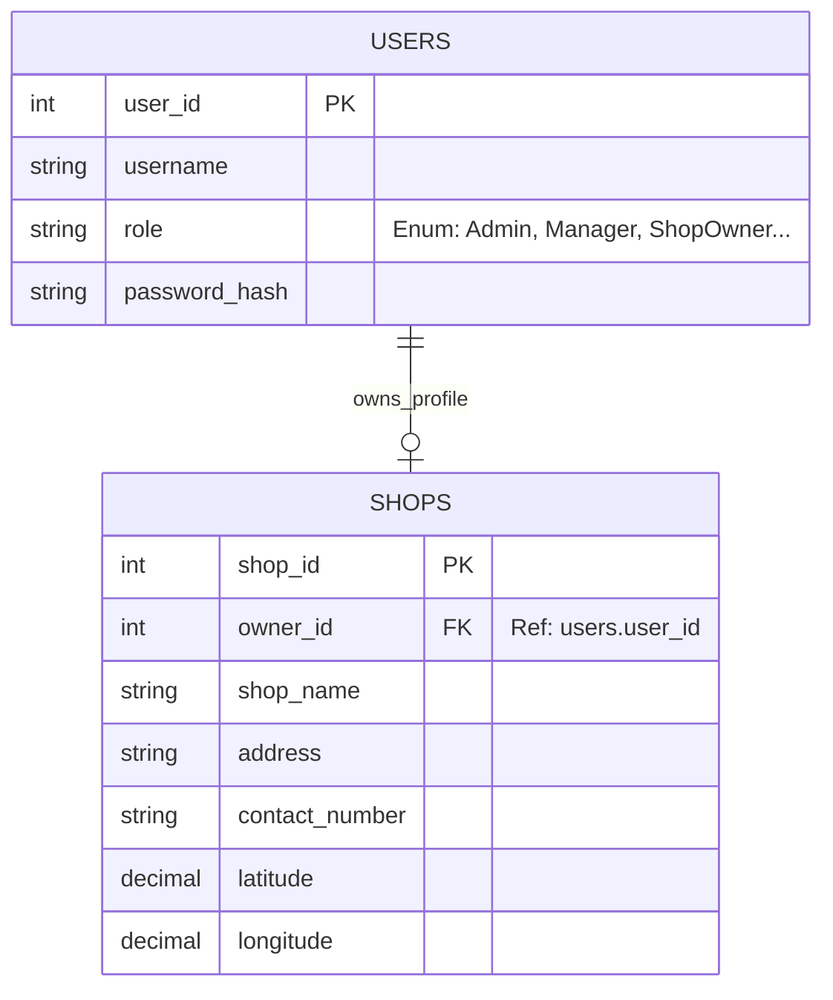
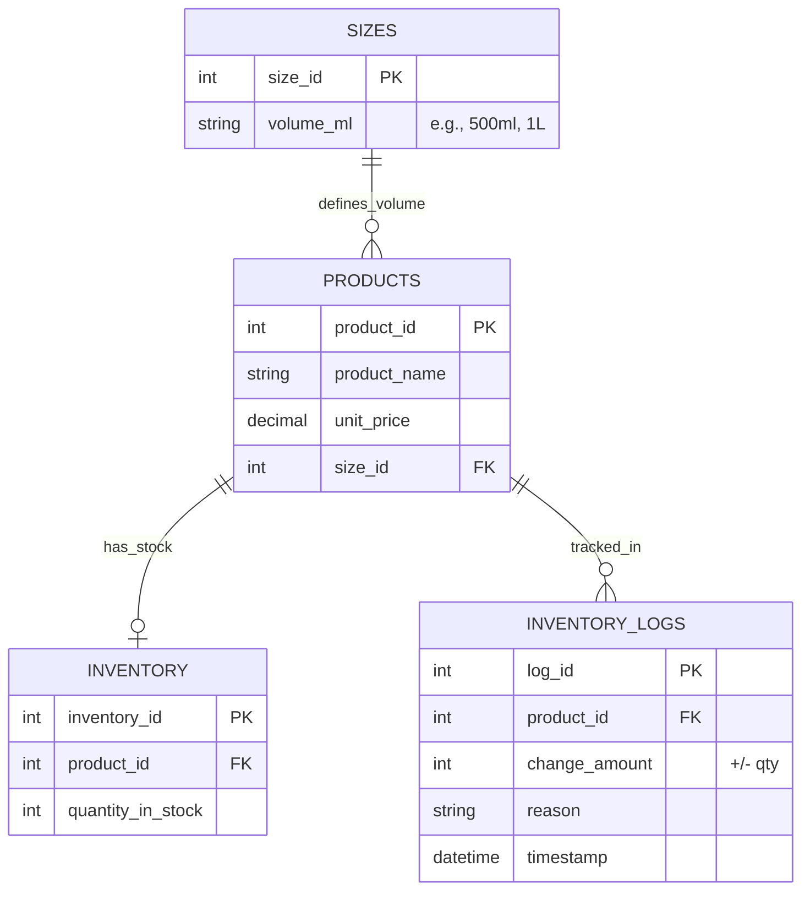
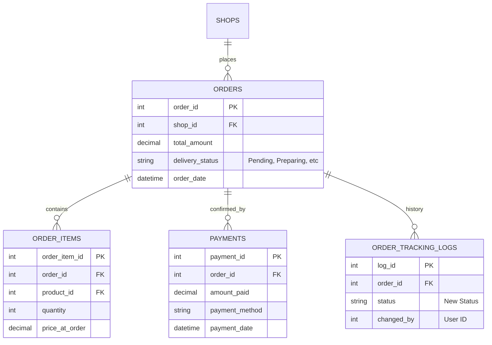
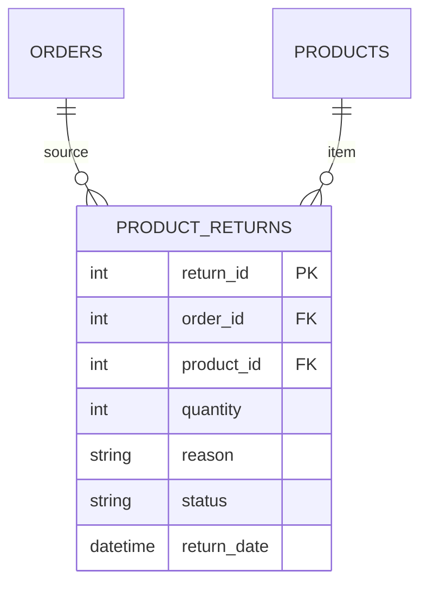
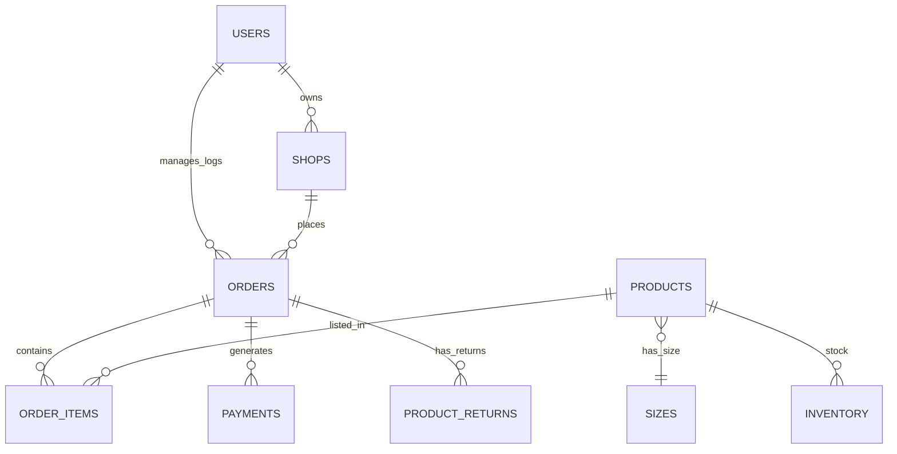

# PIVO Soft Drink Distributing System - System Design Document

## 1. Executive Summary
The PIVO System is a centralized web platform for managing soft drink distribution. It connects Factory Owners, Store Managers, Sales Reps, and Shop Owners to streamline inventory tracking, order fulfillment, and logistics.

---

## 2. Module-Level Design & Data Diagrams

### Module 1: Authentication & User Management
**Description:**  
Manages user identities, secure login, and role-based access control (RBAC). Also handles Shop registration profiles.

**Data Tables:**
*   `users`: Core credentials and roles.
*   `shops`: Extension of user data for Shop Owners.

**Data diagram (ERD):**


---

### Module 2: Product & Inventory Management
**Description:**  
Handles product definitions (name, price), dynamic bottle sizes, and real-time stock levels. Tracks all stock adjustments via logs.

**Data Tables:**
*   `products`: Master product list.
*   `sizes`: Normalized bottle volumes.
*   `inventory`: Current stock quantity.
*   `inventory_logs`: Audit trail of changes.

**Data Diagram (ERD):**


---

### Module 3: Ordering & Payments
**Description:**  
Allows Shop Owners to place orders. Managers confirm these orders, which triggers payment recording and status updates.

**Data Tables:**
*   `orders`: Order header (Status, Total).
*   `order_items`: Line items.
*   `payments`: Financial records.
*   `order_tracking_logs`: History of status changes (Pending -> Preparing -> Dispatched).

**Data Diagram (ERD):**


---

### Module 4: Product Returns
**Description:**  
Manages reverse logistics. Managers log returned items (damaged/expired), which updates inventory and creates a return record.

**Data Tables:**
*   `product_returns`: Details of the return.

**Data Diagram (ERD):**


---

## 3. System Architecture

### Technology Stack
*   **Frontend:** HTML5, CSS3, JavaScript (Vanilla).
*   **Backend:** PHP 8.0 (PDO for Database Abstraction).
*   **Database:** MySQL (Relational).

### Overall Block Diagram
```mermaid
graph TD
    subgraph "Frontend Layer"
        UI[User Interface (Browser)]
    end
    
    subgraph "Application Layer"
        Auth[Auth Module]
        Ord[Order Engine]
        Inv[Inventory Engine]
        Ret[Returns Engine]
    end
    
    subgraph "Data Layer"
        DB[(MySQL Database)]
    end

    UI --> Auth
    UI --> Ord
    UI --> Inv
    UI --> Ret
    
    Auth --> DB
    Ord --> DB
    Inv --> DB
    Ret --> DB
```

---

## 4. Overall Database Schema (Global View)

